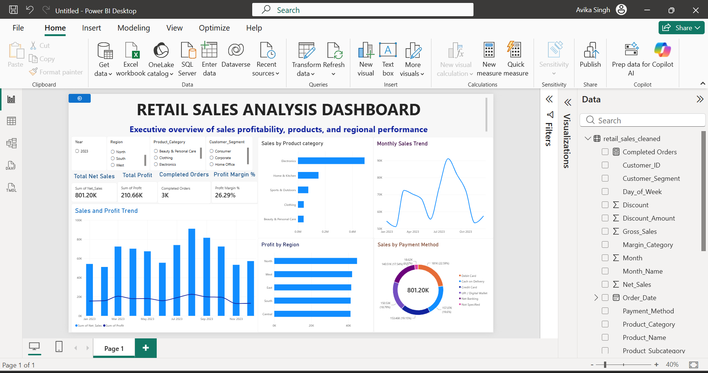

# Retail Sales Analysis Dashboard

## 📊 Project Overview

An interactive retail sales analysis dashboard built using Microsoft Power BI to analyze sales performance, profitability, orders, regions, product categories, payment methods, and customer segments.

## 🎯 Objective

The objective of this project is to transform retail sales data into an interactive dashboard that helps users understand overall business performance and explore sales and profit trends across different business dimensions.

## 🛠️ Tools & Technologies

- Microsoft Power BI
- Power Query
- Data Visualization
- Data Analysis
- DAX

## 📌 Key Performance Indicators

- Total Net Sales
- Total Profit
- Completed Orders
- Profit Margin %

## 📈 Dashboard Features

- Sales and Profit Trend
- Sales by Product Category
- Monthly Sales Trend
- Profit by Region
- Sales by Payment Method
- Interactive Year filter
- Interactive Region filter
- Interactive Product Category filter
- Interactive Customer Segment filter

## 🔍 Analysis

The dashboard allows users to interactively filter the data by year, region, product category, and customer segment. The KPI cards and visualizations update according to the selected filters.

## 🖼️ Dashboard Preview

## 📂 Project Files

- `Retail_Sales_Analysis_Dashboard.pbix` – Power BI dashboard file
- `dashboard.png` – Dashboard preview image
